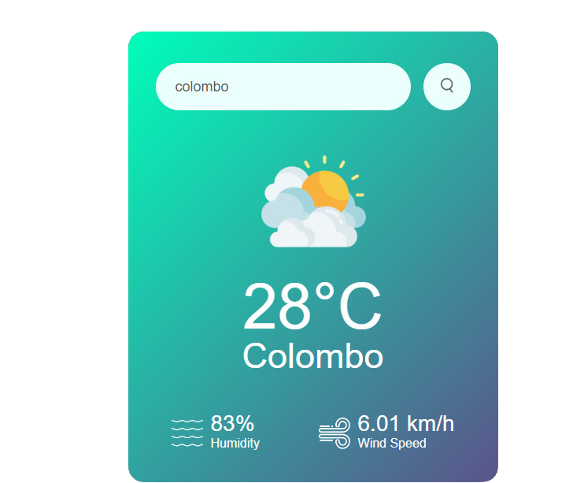

# Vihara Senindu Weather Web App ⚡️
Introducing our innovative Weather Web App, a dynamic tool crafted using HTML, CSS, and JavaScript technologies. Get precise weather updates effortlessly, making it ideal for planning, adventurers, and weather enthusiasts



## How To Use 

```bash

# Clone this repository
git clone https://github.com/viharasenindu/weather

```
## Language & Technology Used 

- [HTML](https://en.wikipedia.org/wiki/HTML5)
- [CSS](https://en.wikipedia.org/wiki/CSS)
- [JAVASCRIPT](https://en.wikipedia.org/wiki/JavaScript)
- [Weather API](https://openweathermap.org/)

## Developer
- [Creator](https://github.com/ViharaSenindu)